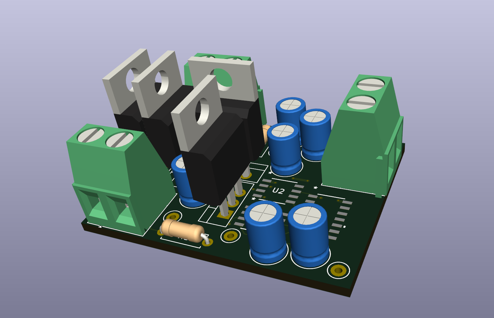
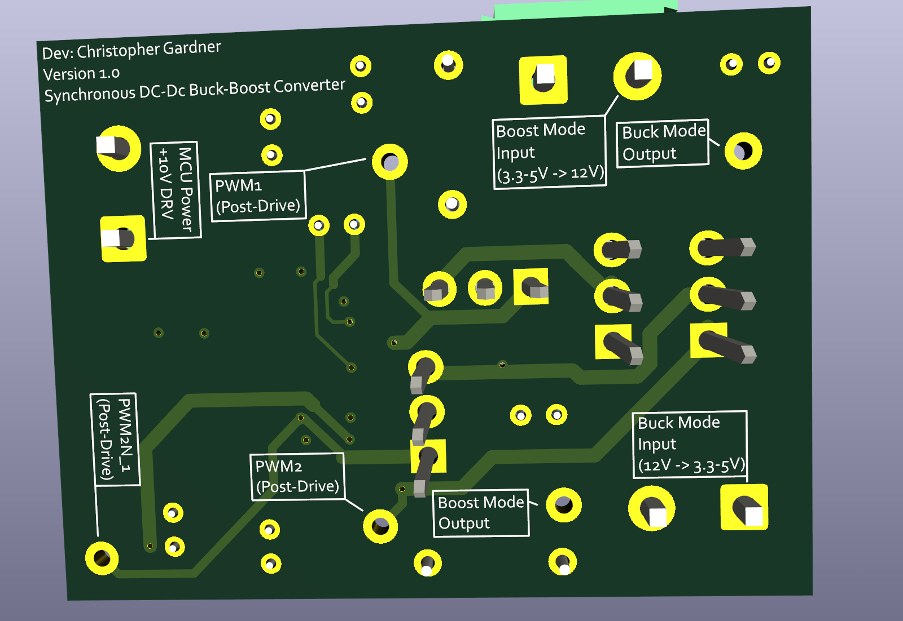

# STM32 Controlled Bidirectional DC-DC Converter

• Designed the embedded gate-drive architecture using complementary PWM with dead-time insertion, integrating half-bridge gate drivers and an AVR microcontroller to safely control all four MOSFETs while preventing shoot-through.

• Designed and simulated a bidirectional synchronous buck-boost converter using PSpice, performing power stage design, MOSFET gate-drive analysis, and converter validation from schematic through functional verification.

• Engineered a 100 kHz complementary PWM control architecture with dead-time insertion for a four-MOSFET synchronous converter, validating gate-drive timing and switching behavior using circuit simulation.

